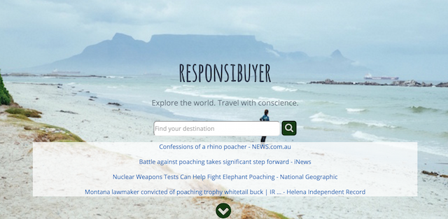
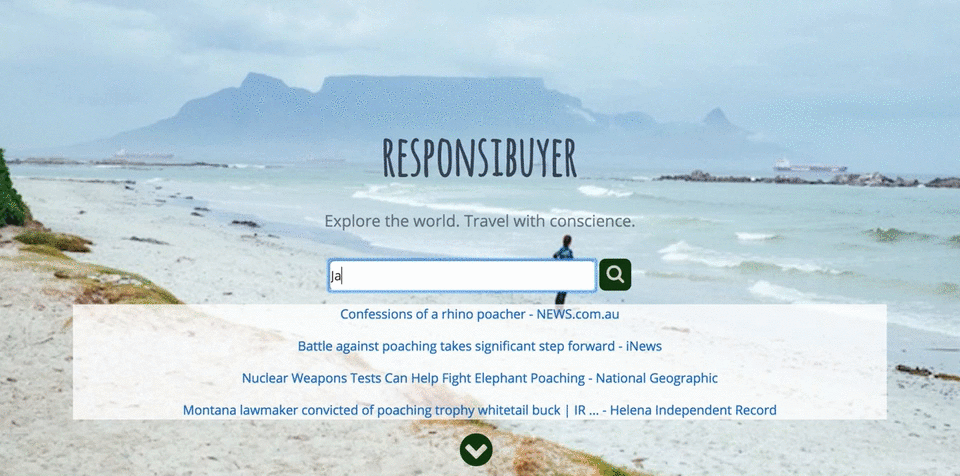

# Zoohackathon: Responsibuyer

The purpose of this app is to help increase awareness of illegal or harmful products you may find when going on vacation.

This application was developed on October 8th, 2016 for the [Zoohackathon](http://www.zoohackathon.com/).

Our app is live at http://responsibuyer.blueb.org:5000/. You can also check out our application in action below: 

## Challenge and Approach

Our submission is for [Challenge #7. Decrease Purchase of Illegal Wildlife Products](https://www.wildlabs.net/community/thread/272).

Our approach for satisfying this challenge was to:

- Create an easy to access site for searching based on destination
- Provide examples of known products that have a negative impact on native wildlife
- Allow users to look further into the products and the impact had on wildlife populations

## Team Members

Our team is comprised of:

- [@bonecrushereb](https://github.com/bonecrushereb) - Benjamin Nolan
- [@florean](http://github.com/florean) - Nathan Florea
- [@handigarde](http://github.com/handigarde) - Ryan Handy
- [@Jaemu](http://github.com/Jaemu) - Jill Handy
- [@wshelor](http://github.com/wshelor) - Will Shelor
- [@mfm24](http://github.com/mfm24) - Matt Murfitt

## Technologies, APIs, and Datasets Utilized

We made use of:

- Webapp with responsive Javascript (details!)
- [Flask](http://flask.pocoo.org/) application for serving data
- Postgres backend for storage
- [IUCN Redlist API](http://apiv3.iucnredlist.org/api/v3/docs) for information on endangered species
- [Wildlife trade tracker](http://wildlifetradetracker.org/) for information on harmful products
- [Wikipedia](https://wikipedia.org) for animal descriptions

## Contributing

In order to build and run our app:

1. Clone the repository
2. Build database on `docs/schema.sql`
3. Unzip data/responsibuyer.sql.gz
4. `psql responsibuyer < responsibuyer.sql` to populate the database
5. `python main.py` to start the webserver

Our code is licensed under the [Apache License](LICENSE). Pull requests will be accepted to this repo, pending review and approval.
